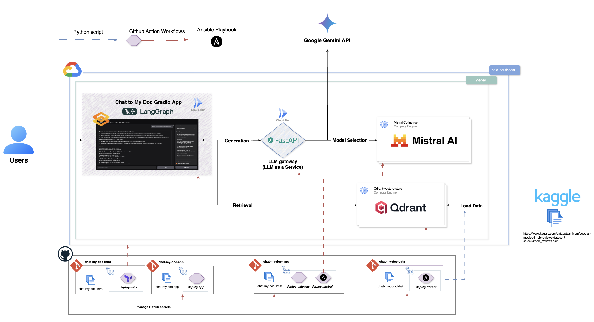

# Chat My Doc Infrastructure

Terraform configuration for deploying Google Cloud infrastructure for the Chat My Doc application.


## Architecture



The complete chat-my-doc system consists of four specialized repositories:

- **[chat-my-doc-app](https://github.com/Philippe-Neveux/chat-my-doc-app)**: Gradio-based web application providing an intuitive chat interface for users to interact with AI models and explore IMDB movie reviews through conversational queries.

- **[chat-my-doc-data](https://github.com/Philippe-Neveux/chat-my-doc-data)**: Data processing pipeline that extracts IMDB movie reviews from Kaggle datasets and ingests them into a Qdrant vector database hosted on Google Cloud Engine for efficient similarity search.

- **[chat-my-doc-llms](https://github.com/Philippe-Neveux/chat-my-doc-llms)**: FastAPI-based LLM gateway service that provides unified access to multiple AI models, including Google's Gemini API and a self-hosted Mistral model deployed on Google Cloud Engine.

- **[chat-my-doc-infra](https://github.com/Philippe-Neveux/chat-my-doc-infra)**: Infrastructure as Code (Terraform) repository containing all Google Cloud Platform infrastructure definitions, enabling reproducible and scalable deployment of the entire system.


## Overview

This infrastructure includes:
- Project API enablement
- IAM service accounts and keys
- Artifact Registry repositories
- Cloud Run service IAM configuration

## Prerequisites

- Google Cloud SDK installed and configured
- Terraform >= 1.0
- Access to a Google Cloud project
- GitHub personal access token (for repository secrets)

## Configuration

### Required Variables

Create a `terraform.tfvars` file with the following variables:

```hcl
project_id = "your-project-id"
location = "australia-southeast1"
region = "australia-southeast1"
zone = "australia-southeast1-b"
github_owner = "your-github-username"
github_token = "your-github-token"
```

The `cloud_run_invoker_email` variable has a default value set to `pneveux.gcp@gmail.com`. Update this in `modules/cloud_run/variables.tf` if needed.

## Usage

1. **Initialize Terraform:**
   ```bash
   terraform init
   ```

2. **Plan the deployment:**
   ```bash
   terraform plan
   ```

3. **Apply the configuration:**
   ```bash
   terraform apply
   ```

## Modules

### Project Services
Enables required Google Cloud APIs for the project.

### IAM
Creates service accounts and manages their keys, storing them as GitHub repository secrets.

### Artifact Registry
Sets up container repositories for storing Docker images.

### Cloud Run
Configures IAM policy binding to grant Cloud Run invoker access to the specified user.

## Cloud Run IAM Access

The Cloud Run module automatically grants `roles/run.invoker` permission to the user specified in the `cloud_run_invoker_email` variable. This is equivalent to running:

```bash
gcloud run services add-iam-policy-binding llm-gateway \
    --member="user:pneveux.gcp@gmail.com" \
    --role="roles/run.invoker" \
    --region=australia-southeast1
```

## Outputs

Check `outputs.tf` for available output values after deployment.

## Cleanup

To destroy all resources:

```bash
terraform destroy
```